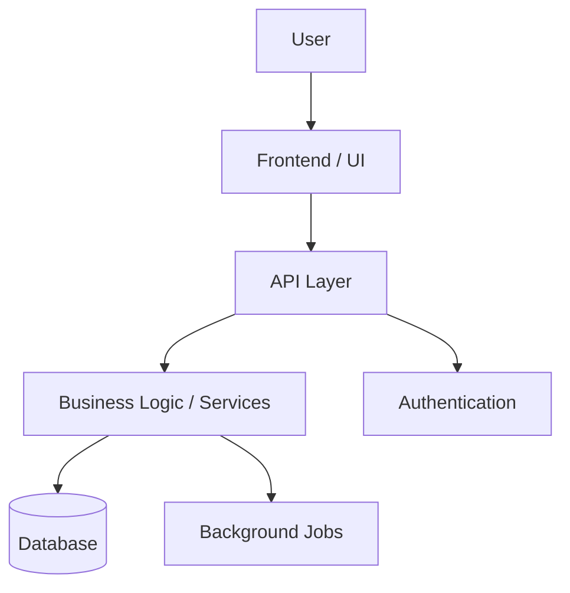

# Repository Onboarding Skill

## Purpose

Use this skill when a developer is joining or exploring an existing codebase for the first time.

The goal is not only to summarize the repository, but to help the developer build a clear mental model of:

- What the project is.
- How the system is structured.
- Where the important logic lives.
- How code flows through the application.
- How contributors appear to work in this repository.
- What should be read first.
- What areas are risky or unclear.

The output should be practical, grounded in the repository files, and useful for someone who needs to start making changes safely.

---

## Core Principles

When analyzing the repository:

1. Prefer evidence from files over assumptions.
2. Distinguish clearly between facts, inferences, and unknowns.
3. Do not invent contribution rules, architecture, CI/CD, deployment, or workflows.
4. Explain the repository as it actually appears, not as it should ideally be.
5. Focus on helping a developer become productive.
6. Avoid generic descriptions such as "contains code" or "utility functions."
7. Explain why files and folders exist where they are.
8. Prioritize mental model, architecture, flows, and change guidance over exhaustive documentation.
9. When the repository is large, summarize low-signal files and go deeper on architectural or frequently touched files.
10. Always include uncertainty when something cannot be determined from the files.

---

## Internal Analysis Process

Before producing the final onboarding report, inspect the repository in this order when available.

### 1. Repository Identity

Look for:

- `README.md`
- repository name
- project metadata
- package manifests
- dependency files
- configuration files
- Docker files
- CI/CD files
- entry points

Common files:

- `package.json`
- `pnpm-lock.yaml`
- `yarn.lock`
- `package-lock.json`
- `pyproject.toml`
- `requirements.txt`
- `Pipfile`
- `poetry.lock`
- `Cargo.toml`
- `go.mod`
- `composer.json`
- `Gemfile`
- `Dockerfile`
- `docker-compose.yml`
- `.github/workflows/*`

Determine:

- project name
- project type
- likely maturity
- main runtime
- main entry points
- whether it is an app, service, library, CLI, notebook, monorepo, template, or proof of concept

---

### 2. Stack and Tooling

Identify:

- programming languages
- frameworks
- package managers
- build tools
- test tools
- linting/formatting tools
- database tools
- authentication tools
- background job tools
- deployment tools
- CI/CD tools

Separate important dependencies from secondary dependencies.

Do not list every dependency. Focus on the dependencies that explain how the system works.

---

### 3. Architecture and Structure

Analyze:

- top-level folders
- source folders
- routing conventions
- API boundaries
- domain modules
- shared utilities
- config files
- persistence layer
- tests
- scripts
- deployment infrastructure

Identify architectural patterns such as:

- frontend-only app
- backend API
- full-stack app
- CLI tool
- worker-based system
- monorepo
- layered architecture
- feature-based architecture
- framework-driven architecture
- notebook/research project
- infrastructure-as-code repository

---

### 4. File and Folder Role Mapping

For each important folder, explain:

- what it contains
- why it exists
- how it relates to the rest of the system
- whether it follows framework conventions
- what kind of changes usually belong there

For each important file, explain:

- its role
- what it controls
- what depends on it
- whether it is an entry point, config file, domain file, utility, test, migration, or generated artifact

For minor files, provide compact one-line descriptions.

---

### 5. System Flows

Identify the main workflows implemented by the project.

Examples:

- user authentication
- request/response lifecycle
- page rendering
- API endpoint handling
- database reads/writes
- background job execution
- CLI command execution
- data ingestion
- model training
- deployment pipeline
- test execution

Explain each flow as a sequence of files/components.

---

### 6. Contribution Reality

Infer how contributors appear to work based on visible files.

Look for:

- `CONTRIBUTING.md`
- README instructions
- scripts
- tests
- linters
- formatters
- GitHub Actions
- CI workflows
- PR templates
- issue templates
- commit hooks
- pre-commit config
- husky config
- conventional commit config
- changelog/release tooling
- test coverage
- existing code style

Important:

- Do not invent contribution rules.
- If no explicit process exists, say so.
- Reflect actual repository evidence.
- Mention likely expectations based on scripts and tooling.
- Mention gaps, such as missing tests, missing CI, missing docs, or unclear branch strategy.

---

### 7. Developer Guidance

Provide actionable guidance:

- what to read first
- where to make common changes
- what commands to run
- what risks to watch for
- what prior knowledge is needed
- what parts are uncertain

The output should help the developer decide where to start.

---

## Required Output Format

Produce the onboarding report using exactly the following sections.

---

# 1. Project Name

State the project name.

If the name is explicit, use it.

If it is inferred from the folder name, package metadata, or README, say that it is inferred.

Include, when useful:

- package name
- repository name
- app/service name
- uncertainty about naming

---

# 2. Conceptual Description

Explain what the project is in plain English.

Include:

- what kind of project it is
- what problem it appears to solve
- who or what it serves
- whether it is a frontend, backend, full-stack app, CLI, library, notebook, infrastructure repo, monorepo, etc.
- the main responsibilities of the codebase

Avoid vague descriptions.

Bad:

> This is a Python project.

Good:

> This appears to be a FastAPI backend that exposes user-management endpoints, validates request payloads with Pydantic, persists data in PostgreSQL, and runs background workflows for long-running tasks.

If the business/domain purpose is unclear, say so.

---

# 3. Frameworks and Languages Used

List the main languages and frameworks.

Separate them into:

## Languages

Example:

- TypeScript
- Python
- SQL

## Frameworks

Example:

- Next.js
- React
- FastAPI
- Django
- Express
- Prefect

## Runtime / Platform

Example:

- Node.js
- Python 3.x
- Docker
- Vercel
- AWS Lambda

Mention how you detected them, using file evidence when possible.

---

# 4. Tools and Libraries Used, and What They Are For

List the important tools and libraries.

Group them by purpose.

Example:

## Application Core

- `next`: frontend/full-stack framework.
- `react`: UI rendering.
- `fastapi`: HTTP API framework.

## Data / Persistence

- `prisma`: database schema and ORM.
- `sqlalchemy`: database access layer.
- `postgres`: likely relational database.

## Validation

- `zod`: runtime validation for TypeScript.
- `pydantic`: request and domain validation for Python.

## Authentication

- `next-auth`: authentication and session management.

## Testing

- `pytest`: Python test runner.
- `vitest`: TypeScript test runner.
- `playwright`: browser/end-to-end testing.

## CI/CD and Automation

- `github actions`: automated checks/deployment workflows.
- `docker`: containerized runtime.

Do not list every library. Prioritize libraries that matter for understanding the repository.

---

# 5. Architecture Diagram

Provide a high-level architecture diagram.

Prefer Mermaid when possible.

Example:



After the diagram, briefly explain the main components and how they interact.

If the architecture is unclear, provide the best inferred diagram and mark it as inferred.

---

# 6. Function and Purpose of Each File and Folder

Explain the repository structure.

Use this format:

## Top-Level Structure

| Path | Purpose |
|---|---|
| `src/` | Main application source code. |
| `tests/` | Automated tests. |
| `package.json` | Node.js package metadata and scripts. |
| `README.md` | Project documentation and setup instructions. |

## Important Folders

For each important folder:

### `path/to/folder/`

Explain:

- what it contains
- why this folder exists
- how it fits into the architecture
- what kind of changes usually happen here

## Important Files

For each important file:

### `path/to/file.ext`

Explain:

- what the file does
- whether it is an entry point, configuration file, domain module, route, service, model, test, script, or generated file
- why it matters
- what other parts of the system likely depend on it

## Full File Inventory

When useful, include a compact file inventory:

| File | Role |
|---|---|
| `src/app/page.tsx` | Main page route. |
| `src/lib/auth.ts` | Authentication configuration. |
| `prisma/schema.prisma` | Database schema definition. |

Avoid generic descriptions. Be specific.

---

# 7. How to Contribute to This Repository

Describe how developers appear to contribute based on repository evidence.

Include:

## Observed Workflow

Mention visible evidence such as:

- setup commands
- development commands
- test commands
- lint commands
- formatting commands
- CI/CD checks
- branch or PR guidance
- commit conventions
- release process

## Expected Local Checks

List commands found in the repo.

Example:

```bash
npm run lint
npm run test
npm run build
```

or:

```bash
pytest
ruff check .
mypy .
```

## Contribution Style Inferred from the Codebase

Explain:

- whether tests appear expected
- whether formatting/linting appears enforced
- whether changes should follow existing patterns
- whether PR rules are explicit or unknown
- whether documentation should be updated

Important:

If the repo does not define contribution rules, say:

> No explicit contribution process was found. The following guidance is inferred from scripts, tooling, and existing structure.

---

# 8. Recommended Prior Knowledge

List what a developer should know before working on this repository.

Group it like this:

## Required

Knowledge needed to safely make common changes.

## Recommended

Knowledge that helps understand the repo better.

## Area-Specific

Knowledge needed only for specific parts.

Example:

- To work on authentication: NextAuth/session handling.
- To work on database changes: Prisma migrations/PostgreSQL.
- To work on deployment: Docker/GitHub Actions.
- To work on background jobs: Celery/Prefect/queues.

---

# 9. Recommended Reading Path

Give a suggested order for reading the repository.

The reading path should be practical and specific.

Example:

1. `README.md` — understand setup and project intent.
2. `package.json` — understand scripts and dependencies.
3. `src/app/layout.tsx` — understand the root application shell.
4. `src/app/page.tsx` — understand the default user-facing entry point.
5. `src/app/api/` — understand backend routes.
6. `src/lib/auth.ts` — understand authentication.
7. `prisma/schema.prisma` — understand data models.
8. `.github/workflows/` — understand CI/CD.

For each item, explain why it should be read at that point.

---

# 10. Main System Flows

Describe the main flows through the system.

Use diagrams or step-by-step sequences.

Examples:

## Request Flow

```text
User action
→ Frontend route/component
→ API endpoint
→ Service/domain logic
→ Database
→ Response
→ UI update
```

## Authentication Flow

```text
Login form
→ auth provider
→ session creation
→ middleware/session check
→ protected page/API access
```

## Background Job Flow

```text
API trigger
→ job scheduler/queue
→ worker
→ database update
→ status returned to user
```

For each flow, reference the files or folders involved.

If flows cannot be confidently identified, explain what is visible and what is uncertain.

---

# 11. Where to Make Common Changes

Provide practical guidance for common development tasks.

Use this format:

## If you want to add or change a page

Look at:

- `...`

Why:

- `...`

## If you want to add or change an API endpoint

Look at:

- `...`

Why:

- `...`

## If you want to change database models

Look at:

- `...`

Why:

- `...`

## If you want to change authentication/authorization

Look at:

- `...`

Why:

- `...`

## If you want to add tests

Look at:

- `...`

Why:

- `...`

Adapt these categories to the actual repository.

Do not include categories that do not apply.

---

# 12. Risks and Sensitive Areas

Identify risky or delicate parts of the repository.

Examples:

- central authentication files
- database schema/migrations
- environment variable handling
- deployment config
- payment logic
- background workers
- shared utilities used everywhere
- generated files
- files with high coupling
- missing tests
- unclear ownership
- large files doing too much
- hidden assumptions
- dangerous scripts
- production-impacting config

For each risk, include:

- what the risk is
- where it is
- why it matters
- how to approach changes safely

Example:

> `src/lib/auth.ts` is sensitive because it centralizes authentication and session behavior. Changes here may affect protected pages, API authorization, and user identity handling. Modify it carefully and test login/logout flows afterwards.

---

# 13. Assumptions and Uncertainty

Clearly state what is known, inferred, and unknown.

Use this format:

## Known from Files

- The project uses Next.js because `next` appears in `package.json`.
- The project has GitHub Actions because `.github/workflows/ci.yml` exists.

## Inferred

- The app likely uses PostgreSQL because Prisma is configured with a PostgreSQL provider.
- The repository appears to be a full-stack app because it contains both UI routes and API routes.

## Unknown / Not Visible

- Deployment target is not visible.
- Branching strategy is not documented.
- PR requirements are not defined.
- Production environment variables are not included.
- Business domain is unclear from the available files.

Never hide uncertainty. Make it explicit.

---

## Quality Checklist

Before finalizing the report, verify that:

- The project identity is clearly explained.
- The conceptual description is more useful than just listing frameworks.
- The stack is grouped logically.
- Important libraries are explained by purpose.
- The architecture diagram matches the files.
- Folder explanations include why each folder exists.
- File explanations are specific, not generic.
- Contribution guidance reflects actual repository evidence.
- Recommended prior knowledge is actionable.
- The reading path is ordered and justified.
- Main system flows reference concrete files/folders.
- Common change guidance helps a developer know where to work.
- Risks are specific and practical.
- Assumptions and uncertainty are clearly separated.
- No unsupported claims are presented as facts.

---

## Final Behavior

Always respond to the user in Spanish.

When using this skill, produce a structured onboarding report.

Be clear, practical, and evidence-based.

The report should help a developer answer:

- What is this repo?
- How does it work?
- Where should I start reading?
- Where do I make changes?
- What should I avoid touching carelessly?
- What do I need to learn first?
- What is known versus inferred?

Do not simply describe the repository. Help the developer internalize it.
